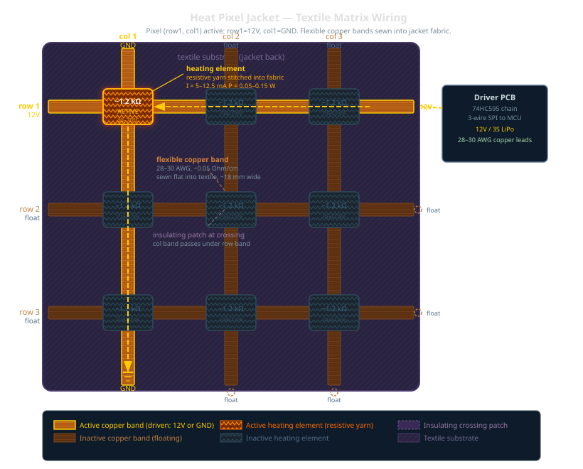

# Heat Pixel Matrix Configurator

An interactive design tool for resistive heat pixel textile matrices — configure, visualise, and export manufacturer specs for smart garment heating grids.

**[→ Open configurator](heat_pixel_matrix_configurator.html)** (open the HTML file directly in any browser)

---

## What it does

Design a matrix of individually addressable heating pixels embroidered into a garment. The tool computes all electrical parameters, draws the full wiring diagram with connector routing, and exports a PDF spec sheet ready to hand to a textile manufacturer.



---

## Features

- **Configurable grid** — set columns, rows, pixel size, garment dimensions
- **Material parameters** — resistance per pixel, yarn resistance (Ω/m), trace pattern and density
- **Live electrical readouts** — power, current, full-row current, copper band requirements, AWG rating
- **Wiring diagram** — SVG rendering of all row/column conductor bands with crossing-free connector routing to a single FPC strip
- **Heater trace patterns** — left-right zigzag, top-bottom zigzag, spiral, diagonal
- **Animation** — visualise scan, row, column, and wave activation patterns
- **Export PDF** — one-click manufacturer spec sheet with wiring diagram, full config table, and fabrication notes

---

## How it works

The matrix uses row/column multiplexing:

```
         COL1 … COLn
          │       │
ROW1 ─[P-ch]─┼─ … ─┤   Each intersection = 1 heater pixel
ROW2 ─[P-ch]─┼─ … ─┤   (conductive yarn spiral)
 …                  │
ROWm ─[P-ch]─┴─ … ─┘
```

- **Row drivers** (high-side P-MOSFETs) energise one row at a time
- **Column drivers** (low-side N-MOSFETs, PWM) select which pixels in that row heat
- **Scan rate** ≥100 Hz — imperceptible to touch, full per-pixel intensity control via duty cycle
- All 32 connector lines (16 rows + 16 cols for a 16×16 grid) route to a single FPC connector

---

## Quick start

1. Open `heat_pixel_matrix_configurator.html` in Chrome or Firefox
2. Set your garment dimensions and pixel size
3. Adjust resistance per pixel and yarn resistance to match your conductive yarn
4. Click **⬇ Export PDF** to generate the manufacturer spec sheet

---

## PCB driver

The companion PCB design (ESP32-C3, 74HC595 shift registers, P/N-MOSFET arrays) lives in [`pcb/heat_pixel_matrix_driver/`](pcb/heat_pixel_matrix_driver/).

Key specs for a 16×16 matrix at 12V:
| Parameter | Value |
|---|---|
| Supply | 12V, 20A (fast warm-up) / 3A (scan mode) |
| Row MOSFETs | SI2333DS P-ch, 20A |
| Col MOSFETs | SI2302DS N-ch, 20A |
| Shift registers | 74HC595 × 4 (2 row + 2 col) |
| MCU | ESP32-C3-MINI |
| Connector | 32-pin FPC 0.5mm |

---

## Research context

Part of research into thermal somatic interfaces for attention regulation, targeting CHI 2027. Supervised at HPI.

---

Made with ♥ by [kryptokommunist](https://github.com/kryptokommunist)
